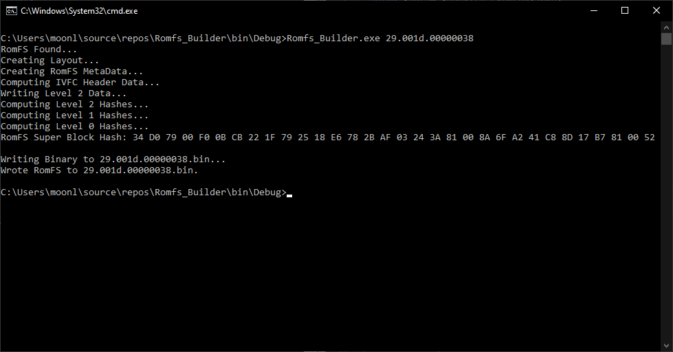

# RomFS-Builder-CMD
Commandline fork of RomFS-Builder, This is a program to convert a folder in windows into a 3DS RomFS binary. For use with makerom.

Usage: `Romfs_Builder.exe [Input Folder Name]`
Input folder must be in the same folder as Romfs Builder.

Credit to Project CTR, upon which much of the code used in the program is based.
